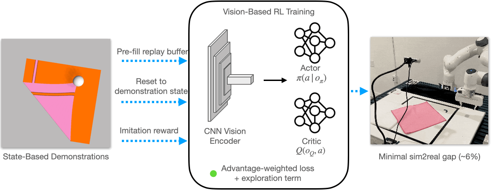

# Learning Deformable Object Manipulation from Expert Demonstrations

[[Project website](https://uscresl.github.io/dmfd)]
[[arXiv PDF](https://arxiv.org/abs/2207.10148)]
[[IEEE manuscript](https://ieeexplore.ieee.org/document/9813374)]

This project is a PyTorch implementation of Learning Deformable Object Manipulation from Expert Demonstrations, published in IEEE RA-L and IEEE IROS, 2022.

<p align="center">
    
</p>

## SoftGym Installation

1. Create new conda environment
```
conda create -n softgym python=3.7
```

2. Install necessary packages for DMfD
```
cd dmfd
mkdir data # for storing experiments
conda env update -n softgym --file environment.yml
```
3. Follow the [docker guide](softgym/docker/docker.md) for PyFlex installation

4. Verify SoftGym is installed properly
```
# First, exit docker
conda activate softgym
export PYFLEXROOT=${PWD}/PyFlex
export PYTHONPATH=${PYFLEXROOT}/bindings/build:$PYTHONPATH
export LD_LIBRARY_PATH=${PYFLEXROOT}/external/SDL2-2.0.4/lib/x64:$LD_LIBRARY_PATH
```
4.1 (OPTIONAL) If you want these env variables set permanently, add these to your `.bashrc`
```
cd path_to_softagent/softgym
echo "export PYFLEXROOT=${PWD}/PyFlex" >> ~/.bashrc
echo "export PYTHONPATH=${PYFLEXROOT}/bindings/build:$PYTHONPATH" >> ~/.bashrc
echo "export LD_LIBRARY_PATH=${PYFLEXROOT}/external/SDL2-2.0.4/lib/x64:$LD_LIBRARY_PATH" >> ~/.bashrc
```
Run experiment
```
python examples/random_env.py --env_name PourWaterAmount # this should open up a GUI window running the PourWater task
```

## SoftAgent Installation


1. Update conda env with additional packages required by SoftAgent
```
# make sure you are at top level folder (/dmfd)
conda env update  --file environment.yml  --prune
```
2. Activate the conda environment by running the following in terminal (outside of docker):

```
. ./prepare_1.0.sh
```
Note that `prepare_1.0.sh` only adds env variables to your current bash. Consider adding these variables to your `.bashrc`, for use on all future bash sessions.

## Downloads

- Download [cached_initial_states](https://huggingface.co/datasets/arthur801031/dmfd/tree/main/cached_initial_states) and place it inside `dmfd/softgym/softgym/` folder

- For reproducing experimental results or training the behavior cloning agent, download [checkpoints](https://huggingface.co/datasets/arthur801031/dmfd/tree/main/checkpoints) and place it on the top level of this project (`dmfd/`)

- For training, DMfD and other Learning from Demonstration methods (BC, SAC-LfD, SAC-BC, AWAC) require expert demonstrations. See 'Generate Expert Demonstrations' below.

## Running benchmarked experiments

- To reproduce results of DMfD and some baselines (SAC, AWAC, BC, SAC-CURL, SAC-DrQ), checkout to the `old` branch to execute training/evaluation scripts. To reproduce results of other baselines (SAC-LfD and SAC-BC), checkout to the `main` branch to execute training/evaluation scripts. **Make sure to recompile Softgym/PyFlex when you checkout a new branch** (see [docker guide](softgym/docker/docker.md)).

- **To use the latest code** (without the need to reproduce plots), feel free to use the code on the `main` branch for all experiments. Remember that you will need to recompile when switching to a new branch, and also regenerate demonstrations for the `main` branch.

### Straighten Rope

```
############ Training ############

# State-based experiments:
sh ./scripts/train/state-dmfd-straighten-rope.sh # DMfD (Ours)
sh ./scripts/train/state-sac.sh # SAC - Set env=RopeFlatten
sh ./scripts/train/state-awac-straighten-rope.sh # AWAC
sh ./scripts/train/state-sac-lfd-straighten-rope.sh # SAC-LfD
sh ./scripts/train/state-bc-straighten-rope.sh # BC-state

# Image-based experiments:
sh ./scripts/train/image-dmfd-straighten-rope.sh # DMfD (Ours)
sh ./scripts/train/image-sac-curl.sh # SAC-CURL - Set env=RopeFlatten and env_kwargs_num_variations=1000
sh ./scripts/train/image-sac-drq.sh # SAC-DrQ - Set env=RopeFlatten and env_kwargs_num_variations=1000
sh ./scripts/train/image-sac-lfd-straighten-rope.sh # SAC-LfD
sh ./scripts/train/image-sac-bc-straighten-rope.sh # SAC-BC
sh ./scripts/train/image-bc-straighten-rope.sh # BC-image

############ Evaluation ############

# State-based experiments:
sh ./scripts/eval/state-dmfd-straighten-rope.sh # DMfD (Ours)
sh ./scripts/eval/state-sac-straighten-rope.sh # SAC
sh ./scripts/eval/state-awac-straighten-rope.sh # AWAC
sh ./scripts/eval/state-sac-lfd-straighten-rope.sh # SAC-LfD
sh ./scripts/eval/state-bc-straighten-rope.sh # BC-state

# Image-based experiments:
sh ./scripts/eval/image-dmfd-straighten-rope.sh # DMfD (Ours)
sh ./scripts/eval/image-sac-curl-straighten-rope.sh # SAC-CURL
sh ./scripts/eval/image-sac-drq-straighten-rope.sh # SAC-DrQ
sh ./scripts/eval/image-sac-lfd-straighten-rope.sh # SAC-LfD
sh ./scripts/eval/image-sac-bc-straighten-rope.sh # SAC-BC
sh ./scripts/eval/image-bc-straighten-rope.sh # BC-image
```

### ClothFold

```
############ Training ############

# State-based experiments:
sh ./scripts/train/state-dmfd-clothfold.sh # DMfD (Ours)
sh ./scripts/train/state-sac.sh # SAC - Set env=ClothFold
sh ./scripts/train/state-awac-clothfold.sh # AWAC
sh ./scripts/train/state-sac-lfd-clothfold.sh # SAC-LfD
sh ./scripts/train/state-bc-clothfold.sh # BC-state

# Image-based experiments:
sh ./scripts/train/image-dmfd-clothfold.sh # DMfD (Ours)
sh ./scripts/train/image-sac-curl.sh # SAC-CURL - Set env=ClothFold and env_kwargs_num_variations=1000
sh ./scripts/train/image-sac-drq.sh # SAC-DrQ - Set env=ClothFold and env_kwargs_num_variations=1000
sh ./scripts/train/image-sac-lfd-clothfold.sh # SAC-LfD
sh ./scripts/train/image-sac-bc-clothfold.sh # SAC-BC
sh ./scripts/train/image-bc-clothfold.sh # BC-image

############ Evaluation ############

# State-based experiments:
sh ./scripts/eval/state-dmfd-clothfold.sh # DMfD (Ours)
sh ./scripts/eval/state-sac-clothfold.sh # SAC
sh ./scripts/eval/state-awac-clothfold.sh # AWAC
sh ./scripts/eval/state-sac-lfd-clothfold.sh # SAC-LfD
sh ./scripts/eval/state-bc-clothfold.sh # BC-state

# Image-based experiments:
sh ./scripts/eval/image-dmfd-clothfold.sh # DMfD (Ours)
sh ./scripts/eval/image-sac-curl-clothfold.sh # SAC-CURL
sh ./scripts/eval/image-sac-drq-clothfold.sh # SAC-DrQ
sh ./scripts/eval/image-sac-lfd-clothfold.sh # SAC-LfD
sh ./scripts/eval/image-sac-bc-clothfold.sh # SAC-BC
sh ./scripts/eval/image-bc-clothfold.sh # BC-image
```

### ClothFoldDiagonalPinned

```
############ Training ############

sh ./scripts/train/image-dmfd-clothfolddiagonalpinned.sh # DMfD (Ours)
sh ./scripts/train/image-sac-curl.sh # SAC-CURL - Set env=ClothFoldRobot and env_kwargs_num_variations=1
sh ./scripts/train/image-sac-drq.sh # SAC-DrQ - Set env=ClothFoldRobot and env_kwargs_num_variations=1
sh ./scripts/train/image-sac-lfd-clothfolddiagonalpinned.sh # SAC-LfD
sh ./scripts/train/image-sac-bc-clothfolddiagonalpinned.sh # SAC-BC
sh ./scripts/train/image-bc-clothfolddiagonalpinned.sh # BC-image

############ Evaluation ############

sh ./scripts/eval/image-dmfd-clothfolddiagonalpinned.sh # DMfD (Ours)
sh ./scripts/eval/image-sac-curl-clothfolddiagonalpinned.sh # SAC-CURL
sh ./scripts/eval/image-sac-drq-clothfolddiagonalpinned.sh # SAC-DrQ
sh ./scripts/eval/image-sac-lfd-clothfolddiagonalpinned.sh # SAC-LfD
sh ./scripts/eval/image-sac-bc-clothfolddiagonalpinned.sh # SAC-BC
sh ./scripts/eval/image-bc-clothfolddiagonalpinned.sh # BC-image
```

### ClothFoldDiagonalUnpinned

```
############ Training ############

sh ./scripts/train/image-dmfd-clothfolddiagonalunpinned.sh # DMfD (Ours)
sh ./scripts/train/image-sac-curl.sh # SAC-CURL - Set env=ClothFoldRobotHard and env_kwargs_num_variations=1
sh ./scripts/train/image-sac-drq.sh # SAC-DrQ - Set env=ClothFoldRobotHard and env_kwargs_num_variations=1
sh ./scripts/train/image-sac-lfd-clothfolddiagonalunpinned.sh # SAC-LfD
sh ./scripts/train/image-sac-bc-clothfolddiagonalunpinned.sh # SAC-BC
sh ./scripts/train/image-bc-clothfolddiagonalunpinned.sh # BC-image

############ Evaluation ############

sh ./scripts/eval/image-dmfd-clothfolddiagonalunpinned.sh # DMfD (Ours)
sh ./scripts/eval/image-sac-curl-clothfolddiagonalunpinned.sh # SAC-CURL
sh ./scripts/eval/image-sac-drq-clothfolddiagonalunpinned.sh # SAC-DrQ
sh ./scripts/eval/image-sac-lfd-clothfolddiagonalunpinned.sh # SAC-LfD
sh ./scripts/eval/image-sac-bc-clothfolddiagonalunpinned.sh # SAC-BC
sh ./scripts/eval/image-bc-clothfolddiagonalunpinned.sh # BC-image
```

### Generate Expert Demonstrations (for DMfD and LfD baselines)

```
# Straighten Rope
 python experiments/generate_expert_trajs.py --save_observation_img=True --num_eps=8000 --env_img_size=32 --env_name=RopeFlatten --save_states_in_folder=False --out_filename=RopeFlatten_numvariations1000_eps8000_image_based_trajs.pkl

# ClothFold
 python experiments/generate_expert_trajs.py --save_observation_img=True --num_eps=8000 --env_img_size=32 --env_name=ClothFold --save_states_in_folder=True --out_filename=ClothFold_numvariations1000_eps8000_image_based_trajs.pkl

# ClothFoldDiagonalPinned
python experiments/generate_expert_trajs.py --save_observation_img=True --num_eps=1000 --env_img_size=32 --env_name=ClothFoldRobot --save_states_in_folder=True --num_variations=1 --out_filename=ClothFoldRobot_numvariations1_eps1000_image_based_trajs.pkl

# ClothFoldDiagonalUnPinned
python experiments/generate_expert_trajs.py --save_observation_img=True --num_eps=1000 --env_img_size=32 --env_name=ClothFoldRobotHard --save_states_in_folder=True --num_variations=1 --out_filename=ClothFoldRobotHard_numvariations1_eps1000_image_based_trajs.pkl

```

## Cite
If you find this codebase useful in your research, please consider citing:
```
@article{salhotra2022dmfd,
	author={Salhotra, Gautam and Liu, I-Chun Arthur and Dominguez-Kuhne, Marcus and Sukhatme, Gaurav S.},
	journal={IEEE Robotics and Automation Letters},
	title={Learning Deformable Object Manipulation From Expert Demonstrations},
	year={2022},
	volume={7},
	number={4},
	pages={8775-8782},
	doi={10.1109/LRA.2022.3187843}
}
```
