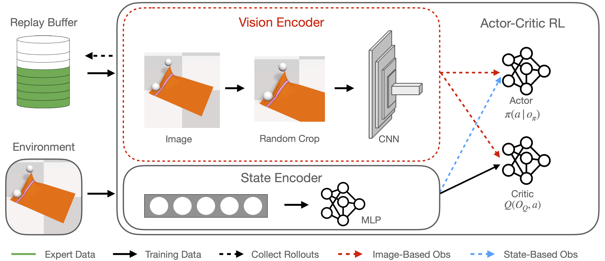
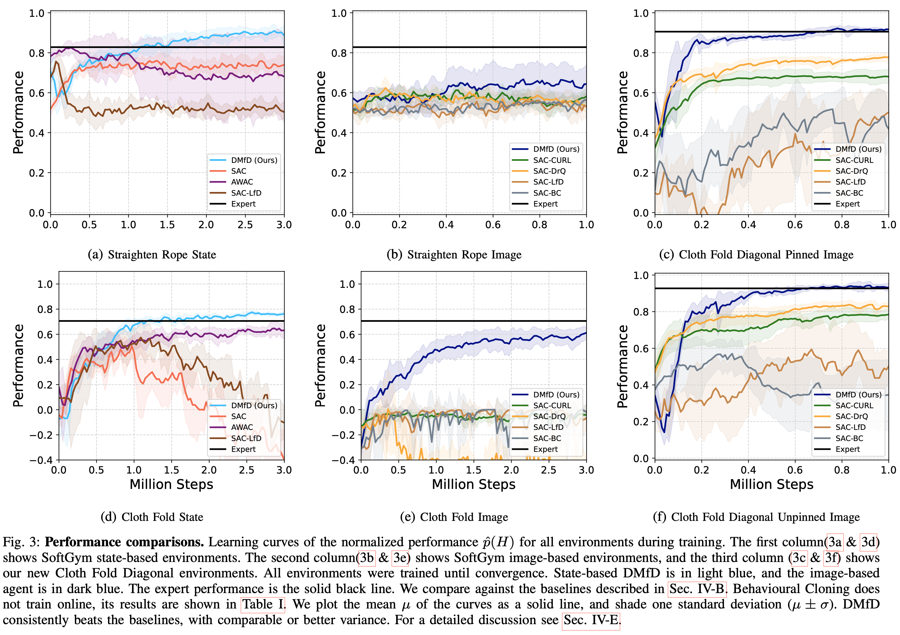

----

## Overview



Manipulating deformable objects is a formidable challenge: extracting state information and modeling are both difficult problems and the task is dauntingly high-dimensional with a large action space. Learning to manipulate deformable objects from expert demonstrations may offer a way forward to alleviate some of these problems. We propose a new Learning from Demonstration (LfD) method – **Deformable Manipulation from Demonstrations (DMfD)** – that works with high-dimensional state or image observations. It absorbs expert guidance, whether from human execution or hand-engineered, while learning online to solve challenging deformable manipulation tasks such as cloth folding.

----

## Results

The following rollouts are generated from our image-based DMfD agent.

<br>

**Real Robot Experiments**

* The objective is to fold the cloth along a specified diagonal of a square cloth, with a single end-effector (ClothFoldDiagonalUnPinned task).

<div class="w3-row-padding">
	<video height="auto" width="100%" controls autoplay loop muted>
		<source src="./video/dmfd_real_1.mp4" type="video/mp4">
	</video>
</div>

<div class="w3-row-padding">
	<video height="auto" width="100%" controls autoplay loop muted>
		<source src="./video/dmfd_real_2.mp4" type="video/mp4">
	</video>
</div>


**Straighten Rope**

*  The objective is to stretch the ends of the rope a fixed distance from each other, to force the rope to be straightened. Performance is measured by comparing the distance between endpoints to a fixed length parameter.

<div class="w3-row-padding">
	<video height="auto" width="100%" controls autoplay loop muted>
		<source src="./video/dmfd_straighten_rope.mp4" type="video/mp4">
	</video>
</div>

**ClothFold**

* The objective is to fold a flattened cloth into half, along an edge, using two end-effectors. Performance is measured by comparing how close the left and right corners are to each other.

<div class="w3-row-padding">
	<video height="auto" width="100%" controls autoplay loop muted>
		<source src="./video/dmfd_clothfold.mp4" type="video/mp4">
	</video>
</div>

**ClothFoldDiagonalPinned**

* The objective is to fold the cloth along a specified diagonal of a square cloth, with a single end-effector. One corner of the cloth is pinned to the table by a heavy block. Performance is measured by comparing how close the bottom-left and top-right corners are to each other.

<div class="w3-row-padding">
	<video height="auto" width="100%" controls autoplay loop muted>
		<source src="./video/dmfd_clothfolddiagonalpinned.mp4" type="video/mp4">
	</video>
</div>

**ClothFoldDiagonalUnpinned**

* The objective is to fold the cloth along a specified diagonal of a square cloth, with a single end-effector. The cloth is free to move on the table top. Performance is measured by comparing how close the bottom-left and top-right corners are to each other.

<div class="w3-row-padding">
	<video height="auto" width="100%" controls autoplay loop muted>
		<source src="./video/dmfd_clothfolddiagonalunpinned.mp4" type="video/mp4">
	</video>
</div>

----

## Quantitative Results

<div class="w3-row-padding">
  <!-- <p>Learning curves of our method compared to baselines.</p> -->
	
</div>

----

## Citation
```
@article{salhotra2022dmfd,
  title={Learning Deformable Object Manipulation from Expert Demonstrations},
  author={Salhotra, Gautam and Liu, I-Chun Arthur and Dominguez-Kuhne, Marcus and Sukhatme, Gaurav S.},
  journal={IEEE Robotics and Automation Letters},
  year={2022},
  publisher={IEEE}
}
```
<br>
